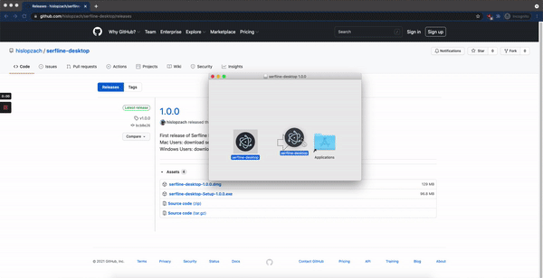

## Serfline Desktop App

### To Install:
1. Navigate to [Releases](https://github.com/hislopzach/serfline-desktop/releases)
1. Download the `.dmg` file latest release (ex: `serfline-desktop-1.0.0.dmg`)
1. Open `.dmg` and drag Icon into Application folder
1. Open application folder, right click on Icon, and select Open
1. You may see a message that the app "cannot be opened because the developer cannot be verified". Hit cancel, and repeat step 4.
1. select Open on the window that pops up

See the gif below for a demonstration of steps 3-6

